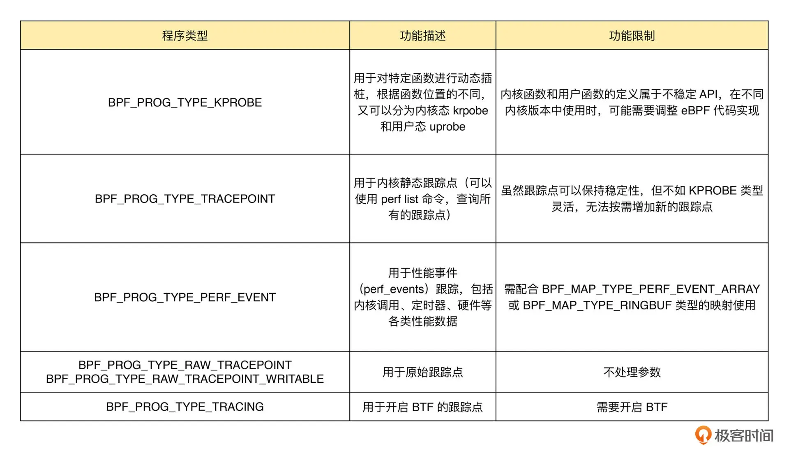
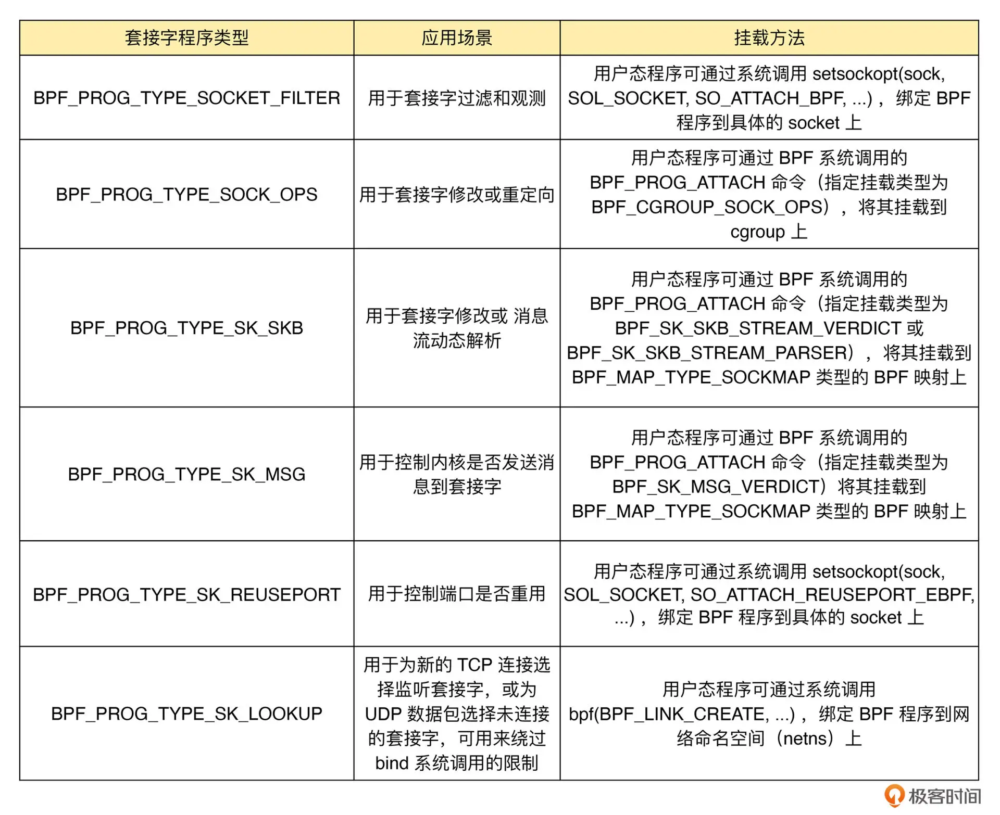
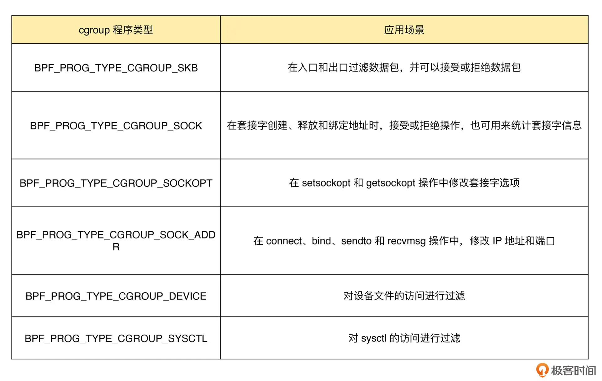

# bpf-samples

### ProgType

对于具体的内核来说，因为不同内核的版本和编译配置选项不同，一个内核并不会支持所有的程序类型。你可以在命令行中执行下面的命令，来查询当前系统支持的程序类型：
```
bpftool feature probe | grep program_type
```

bpf_prog_type
[libbpf/include/uapi/bpf.h](c/libbpf/include/uapi/linux/bpf.h)
```
跟踪类：
跟踪类 eBPF 程序主要是用于从系统中提取跟踪信息，进而为监控、排错、性能优化等提供数据支撑。



网络类：
网络类 eBPF 程序主要用于对网络数据包的过滤和处理，进而实现网络的观测、过滤、流量控制以及性能优化。一般来说分为 XDP (eXpress Data Path, 高速数据路径) 程序、 TC (Traffic Control, 流量控制) 程序、套接字程序 以及 cgroup 程序。

BPF_PROG_TYPE_XDP   网络驱动程序刚刚收到数据包时触发执行，由于无需通过复杂的内核网络协议栈，所以 XDP 程序可以用来实现高性能的网络处理方案，常用于 DDos 防御、防护墙、4层负载均衡等
BPF_PROG_TYPE_SCHED_CLS/BPF_PROG_TYPE_SCHED_ACT TC程序，分别用于流量控制的分类器和执行器。Linux 流量控制通过网卡队列、排队规则、分类器、过滤器以及执行器实现了网络流量的整形调度和带宽控制。

套接字程序:
套接字程序用于过滤、观测或重定向套接字网络包。可以将 eBPF 程序挂载到 套接字(socket) 、控制组(cgroup)以及网络命名空间（netns）等各位置上。


cgroup程序
cgroup 程序用于对 cgroup 内所有进程的网络过滤、套接字选项以及转发等进行动态控制，它最典型的应用场景是对容器中运行的多个进程进行网络控制。


其它


bpf_sec_def
[libbpf/src/libbpf.c](c/libbpf/src/libbpf.c)

怎么知道有哪些插桩、跟踪点、性能事件可以用呢？
#### 内核跟踪点
`cat /sys/kernel/debug/tracing/available_filter_functions`


### attach

attach_kprobe
SEC("kprobe/{func_name}")
SEC("kretprobe/{func_name}")
